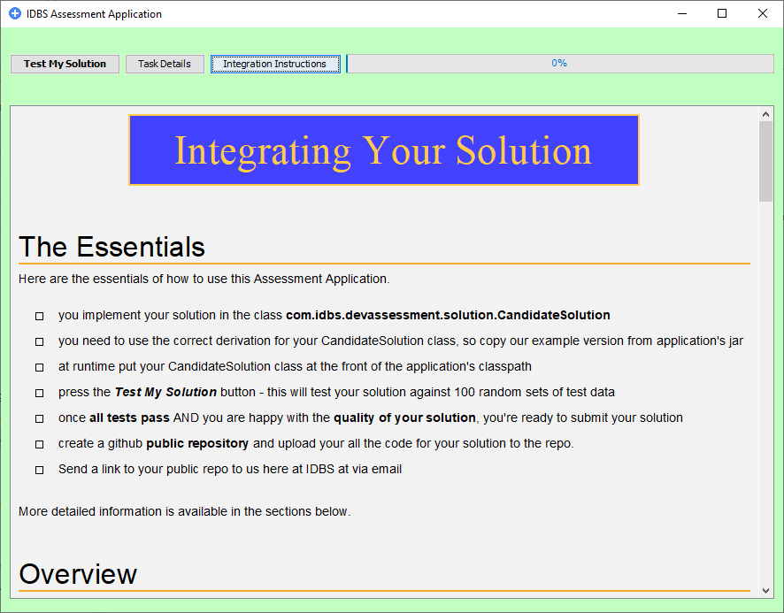

# IDBS Developer Assessment Application

Welcome to the IDBS Developer Assessment Application github repository.

The purpose for this repo is to provide access for ***invited candidates*** to our coding assessment application. 

If you **have been invite** to complete the code assessment phase of our software developer  application process then please continue. If you have **not** been invited, please leave the repository now - we will not accept developer assessment solutions from any persons other than those we have invited through our application process.

# Getting Started

### Step One
Download this repository to your local environment - either clone or download a zip of the repo.

***A note on forking:*** it is best NOT to fork the repository. By forking the repo you will create another ***public repo*** that all other candidates can see and use. This is non-ideal for your application process.

### Step Two
Select your preferred language for your assessment challenge - either **java** or **javascript**. 
The choice of language is entirely yours, we do not mind which you select. The same coding challenge is set in both languages and the difficulty level is the same for both languages.

 - If you select java as your language, drill into the ***java_option*** folder
 - If you select javascript, drill into the ***java_option*** folder
 -- ***UNFORTUNATELY at the current time our javascript option unavailable***

### Step Three - java option
All instructions on how to develop, integrate and ultimately submit your solution can be found by running the assessment application itself. This can be easily achieved by running the dos or linux command files found in the folder ***java-option***. 

Once the application appears, further information on how to develop and integrate your coded solution can be found via the buttons ***Task Details*** and ***Integration Instructions***  at the top of the application's screen (see below).

Note: you need to have java (version 8 or above) installed in your environment to run the assessment application.

### Step Three - javascript option
UNFORTUNATELY our javascript option has not yet been completed and is unavailable. Please complete our coding assessment in java instead.
