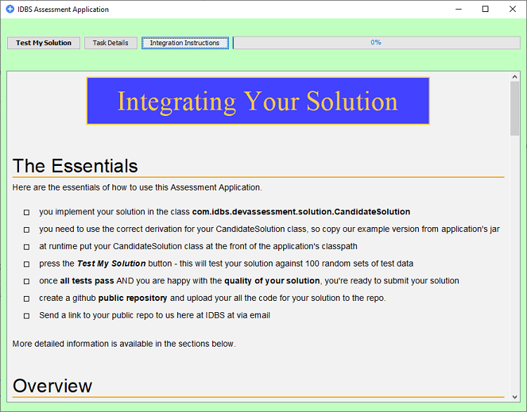

# XIDBS Developer Assessment Application

Welcome to the IDBS Developer Assessment Application github repository.

The purpose for this repo is to provide access for ***invited candidates*** to our coding assessment application. 

If you **have been invited** to complete the code assessment phase of our software developer  application process then please continue. If you have **not** been invited, we are sorry but we cannot accept developer assessment solutions from anybody other than those that have applied and been invited through our job application process. If you are interested in applying to IDBS for a software developer position please visit: 

### www.idbs.com/careers/

# Getting Started

### Step One
Download this repository to your local environment - either clone or download a zip of the repo.

***A note on forking:*** it is best NOT to fork the repository. By forking the repo you will create another ***public repo*** that all other candidates can see and use. This is non-ideal for your application process.

### Step Two - java option
All instructions on how to develop, integrate and ultimately submit your solution can be found by running the assessment application itself. This can be easily achieved by running the "windows cmd" or "bash sh" command line file found in the downloaded folder ***java-option***. 

Once the application starts, further information on how to develop and integrate your coded solution can be found via the buttons ***Task Details*** and ***Integration Instructions***  at the top of the application's screen (see below). The application initially displays the information from the ***Task Details*** screen.

The application is a standalone application; it does not interact with the "outside world" (internet, your local machine, etc.) in anyway.

Note: you need to have java 8 or greater installed in your environment to run the assessment application.

